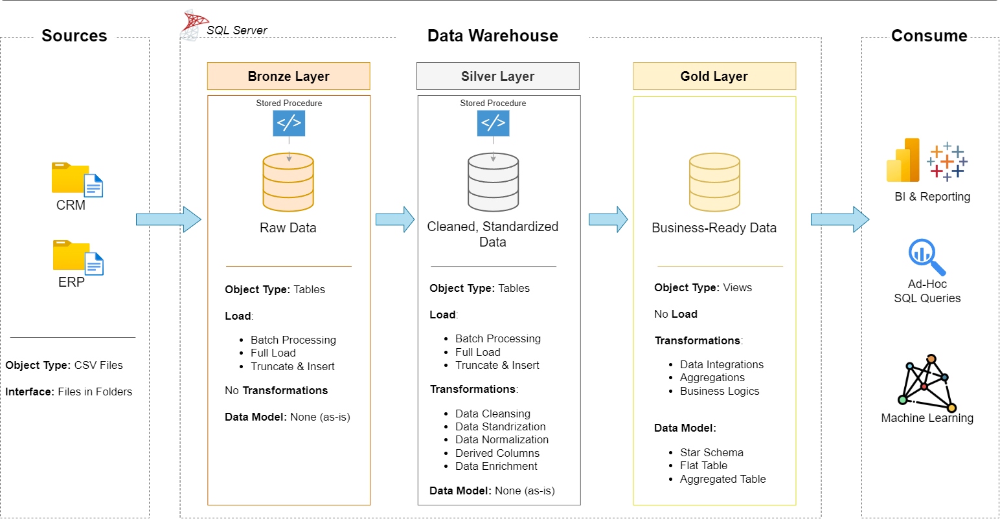

# Data Warehouse Project

A modern end-to-end Data Warehouse implementation built using SQL Server, following the *Medallion Architecture* (Bronze, Silver, and Gold layers). The project demonstrates industry-standard data engineering practices including data ingestion, ETL pipelines, dimensional modeling, and analytical reporting.

The primary objective is to transform raw business data into a structured, analytics-ready warehouse that supports efficient reporting and business intelligence.

---

# Project Architecture

This project follows the Medallion Architecture consisting of three logical layers:



### Bronze Layer
- Stores raw data exactly as received from source systems.
- Data is imported from CSV files into SQL Server.
- No transformations are applied at this stage.

### Silver Layer
- Performs data cleansing and validation.
- Standardizes formats and resolves data quality issues.
- Integrates datasets from multiple source systems.
- Produces clean and consistent datasets.

### Gold Layer
- Creates business-ready analytical models.
- Implements a Star Schema using Fact and Dimension tables.
- Optimized for reporting, dashboards, and business analytics.

---

# Project Objectives

This project focuses on implementing a complete Data Warehouse solution by covering the following areas:

- Designing a scalable Data Warehouse architecture
- Building ETL pipelines using SQL
- Cleaning and transforming raw data
- Integrating ERP and CRM datasets
- Implementing dimensional modeling using Star Schema
- Developing analytical datasets for reporting
- Performing SQL-based business analysis

---

# Key Features

- End-to-End Data Warehouse Implementation
- Medallion Architecture (Bronze → Silver → Gold)
- SQL Server Based ETL Pipelines
- Data Cleansing & Transformation
- Fact and Dimension Table Design
- Star Schema Data Modeling
- Business Analytics Queries
- Production-Style Project Structure

---

# Tech Stack

| Category | Technology |
|----------|------------|
| Database | SQL Server |
| Query Language | T-SQL |
| Data Modeling | Star Schema |
| Architecture | Medallion Architecture |
| Source Data | CSV Files |
| Version Control | Git & GitHub |
| Documentation | Draw.io, Markdown |

---

# Data Pipeline

```
CSV Files
     │
     ▼
Bronze Layer
(Raw Data)
     │
     ▼
Silver Layer
(Cleaned & Standardized Data)
     │
     ▼
Gold Layer
(Business Ready Data)
     │
     ▼
Analytics & Reporting
```

---

# Data Model

The Gold Layer follows a **Star Schema** consisting of:

- Fact Sales
- Dimension Customer
- Dimension Product
- Dimension Date
- Additional supporting dimensions where required

This structure enables efficient analytical queries and reporting.

---

# Repository Structure

```
Data-Warehouse-Project
│
├── datasets/
│
├── docs/
│   ├── data_architecture.drawio
│   ├── data_flow.drawio
│   ├── data_models.drawio
│   ├── data_catalog.md
│   └── naming_conventions.md
│
├── scripts/
│   ├── bronze/
│   ├── silver/
│   ├── gold/
│
├── tests/
│
├── README.md
├── LICENSE
└── .gitignore
```

---

# ETL Workflow

### Bronze
- Load raw CSV files
- Preserve original data
- Maintain source integrity

### Silver
- Remove duplicates
- Handle null values
- Standardize data formats
- Resolve inconsistencies
- Merge source datasets

### Gold
- Create Fact and Dimension tables
- Build Star Schema
- Generate analytics-ready datasets
- Optimize for reporting

---

# Business Analytics

The warehouse supports analytical reporting across multiple business areas, including:

- Customer Analysis
- Product Performance
- Sales Trends
- Revenue Analysis
- Customer Segmentation
- Product Category Analysis
- KPI Reporting

---

# Learning Outcomes

Through this project, the following concepts were implemented:

- Data Warehouse Design
- ETL Pipeline Development
- SQL Programming
- Data Cleaning
- Data Transformation
- Data Integration
- Dimensional Modeling
- Star Schema Design
- Analytical SQL
- Data Engineering Best Practices

---

# Future Improvements

Potential enhancements include:

- Incremental data loading
- Slowly Changing Dimensions (SCD)
- Stored Procedures for ETL automation
- SQL Server Agent scheduling
- Power BI Dashboard Integration
- Data Quality Monitoring
- Performance Optimization
- Cloud deployment using Azure or AWS

---

# License

This project is licensed under the MIT License.

---

# Author

**Tanveer Singh**

Computer Science Engineering Student

Interested in Data Engineering, Data Analytics, Business Intelligence, and Backend Development.